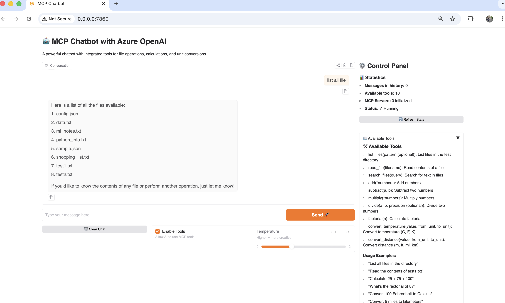

# Gradio Azure OpenAI Chatbot

> A powerful web-based chatbot built with Gradio and Azure OpenAI, featuring integrated tools for file operations, calculations, and unit conversions.

[](https://www.python.org/downloads/)
[](https://gradio.app/)
[](https://opensource.org/licenses/MIT)



## ✨ Features

### 🤖 AI Capabilities
- **Azure OpenAI GPT-4** - Advanced natural language understanding
- **Function Calling** - Automatic tool selection and execution
- **Conversation Memory** - Maintains context across messages
- **Adjustable Temperature** - Control creativity vs. precision

### 🛠️ Integrated Tools
**File Operations:**
- 📄 Read files securely
- 📋 List files with pattern matching
- 🔍 Search content across files

**Calculator:**
- ➕ Basic arithmetic (add, subtract, multiply, divide)
- 📊 Advanced math (factorial, power, square root)
- 🌡️ Temperature conversion (°C ↔ °F ↔ K)
- 📏 Distance conversion (m ↔ ft ↔ mi ↔ km)

### 🎨 Interface Features
- Modern, responsive Gradio UI
- Real-time statistics
- Tool enable/disable toggle
- Temperature control slider
- Quick example prompts

---

## 🚀 Quick Start

### Prerequisites
- Python 3.10 or higher
- Azure OpenAI account with API access
- Azure OpenAI deployment (GPT-4 or GPT-3.5-Turbo)

### Installation

**1. Clone Repository**
```bash
git clone https://github.com/harshv2013/ai-chatbot-with-tools
cd ai-chatbot-with-tools
```

**2. Create Virtual Environment**
```bash
python3 -m venv .venv
source .venv/bin/activate  # On Windows: .venv\Scripts\activate
```

**3. Install Dependencies**
```bash
pip install -r requirements.txt
```

**4. Configure Environment**

Create `.env` file:
```env
AZURE_OPENAI_ENDPOINT=https://your-resource.openai.azure.com/
AZURE_OPENAI_API_KEY=your-api-key-here
AZURE_OPENAI_DEPLOYMENT=gpt-4
AZURE_OPENAI_API_VERSION=2024-02-15-preview

APP_PORT=7860
FILE_SERVER_PATH=./test_files
```

**5. Run Application**
```bash
python app.py
```

**6. Open Browser**
Navigate to: http://localhost:7860

---

## 💡 Usage Examples

### Basic Conversation
```
You: "Explain quantum computing in simple terms"
AI: [Provides clear explanation]
```

### Using File Tools
```
You: "List all files in the directory"
AI: [Uses list_files tool]
     Files found (3):
     - test1.txt
     - test2.txt
     - data.txt
```

### Using Calculator
```
You: "Calculate the factorial of 8, then add 100 to it"
AI: [Uses factorial and add tools]
     8! = 40,320
     40,320 + 100 = 40,420
```

### Complex Queries
```
You: "Read test1.txt and summarize it, then convert 100°F to Celsius"
AI: [Uses read_file and convert_temperature tools]
```

---

## 🏗️ Project Structure
```
gradio-azure-chatbot/
├── app.py                    # Main Gradio application
├── src/
│   ├── __init__.py
│   ├── ai_client.py          # Azure OpenAI integration
│   └── tool_registry.py      # Tool implementations
├── test_files/               # Sample test files
├── .env                      # Environment configuration
├── .gitignore
├── requirements.txt
├── README.md
└── LICENSE
```

---

## 🔧 Configuration

### Environment Variables

| Variable | Description | Required | Default |
|----------|-------------|----------|---------|
| `AZURE_OPENAI_ENDPOINT` | Azure OpenAI endpoint URL | Yes | - |
| `AZURE_OPENAI_API_KEY` | API authentication key | Yes | - |
| `AZURE_OPENAI_DEPLOYMENT` | Model deployment name | Yes | gpt-4 |
| `AZURE_OPENAI_API_VERSION` | API version | No | 2024-02-15-preview |
| `APP_PORT` | Application port | No | 7860 |
| `FILE_SERVER_PATH` | Base path for file operations | No | ./test_files |

---

## 🛠️ Available Tools

| Tool | Description | Example |
|------|-------------|---------|
| **list_files** | List files in directory | "List all .txt files" |
| **read_file** | Read file contents | "Read test1.txt" |
| **search_files** | Search text in files | "Search for 'sample'" |
| **add** | Add numbers | "Add 10, 20, 30" |
| **subtract** | Subtract numbers | "100 minus 25" |
| **multiply** | Multiply numbers | "Multiply 5, 10, 2" |
| **divide** | Divide numbers | "Divide 100 by 4" |
| **factorial** | Calculate factorial | "Factorial of 8" |
| **convert_temperature** | Convert temperature | "100°F to Celsius" |
| **convert_distance** | Convert distance | "5 miles to km" |

---

## 🔒 Security

- ✅ Environment variables for sensitive data
- ✅ Path validation prevents directory traversal
- ✅ API keys never exposed to client
- ✅ File access restricted to designated directory
- ✅ Input validation on all tools

---

## 🐛 Troubleshooting

### Issue: "Azure OpenAI connection failed"
**Solution:** 
- Verify `.env` credentials
- Check endpoint URL format
- Ensure deployment name matches

### Issue: "Tools not working"
**Solution:**
- Enable "Tools" checkbox in UI
- Verify Azure deployment supports function calling (GPT-4/3.5-Turbo)

### Issue: "Port already in use"
**Solution:**
- Change `APP_PORT` in `.env`
- Or: `lsof -ti:7860 | xargs kill`

---

## 🚀 Deployment

### Local Development
```bash
python app.py
```

### Hugging Face Spaces
1. Create new Space
2. Upload files
3. Add secrets in Settings
4. Deploy automatically

### Docker
```dockerfile
FROM python:3.10-slim
WORKDIR /app
COPY requirements.txt .
RUN pip install -r requirements.txt
COPY . .
CMD ["python", "app.py"]
```

Build and run:
```bash
docker build -t gradio-chatbot .
docker run -p 7860:7860 --env-file .env gradio-chatbot
```

---

## 🤝 Contributing

Contributions welcome! Please:
1. Fork the repository
2. Create feature branch (`git checkout -b feature/AmazingFeature`)
3. Commit changes (`git commit -m 'Add AmazingFeature'`)
4. Push to branch (`git push origin feature/AmazingFeature`)
5. Open Pull Request

---

## 📄 License

This project is licensed under the MIT License - see [LICENSE](LICENSE) file for details.

---

## 🙏 Acknowledgments

- **[Gradio](https://gradio.app/)** - Web interface framework
- **[Azure OpenAI](https://azure.microsoft.com/en-us/products/ai-services/openai-service)** - AI capabilities
- **[OpenAI](https://openai.com/)** - GPT-4 model

---

## 📧 Contact

Harsh Vardhan - [@Linkedin](https://www.linkedin.com/in/harsh-vardhan-60b6aa106/) - harsh2013@gmail.com

Project Link: [https://github.com/harshv2013/ai-chatbot-with-tools](https://github.com/harshv2013/ai-chatbot-with-tools)

---

## 🗺️ Roadmap

- [ ] Add streaming responses
- [ ] Implement conversation export
- [ ] Add user authentication
- [ ] Support multiple file formats
- [ ] Add database integration
- [ ] Create comprehensive test suite
- [ ] Add voice input/output

---

**Built with ❤️ using Gradio, Azure OpenAI, and Python**